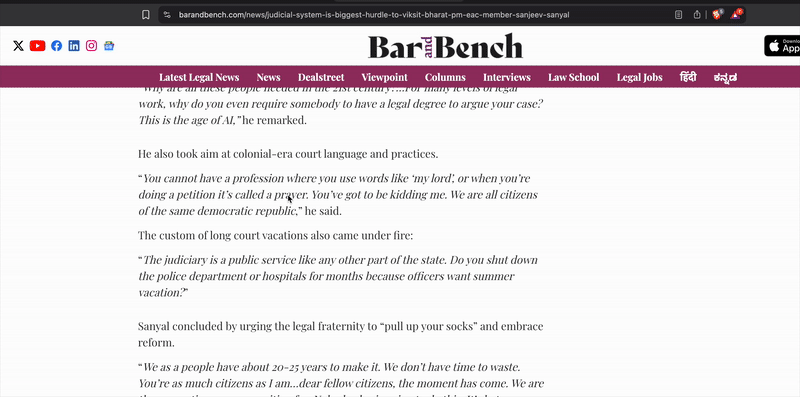

  
   
  <strong>JUSTICE DEFINITIONS PROJECT</strong>

---

A Chrome extension that provides instant access to legal definitions from the [Justice Definitions Project](https://jdc-definitions.wikibase.wiki/wiki/The_Justice_Definitions_Project) - an expert-curated knowledge base for legal terminology. Features a sliding overlay panel that appears on top of webpages without disrupting the user's browsing experience. Built for researchers, students, and practitioners.

## Demo

### Right-Click Lookup

  
   
  <em>See the right-click lookup in action: Select any legal term and right-click for instant definition previews in a floating popup.</em>

### Side Panel Functionality

  
   
  <em>Watch the sliding overlay panel in action: Click the extension icon to open the 400px wide panel that slides in from the right, featuring built-in search and request functionality.</em>

## Installation

1. Clone this repository
2. Open Chrome → `chrome://extensions/`
3. Enable "Developer mode"
4. Click "Load unpacked" → select project folder
5. Extension appears in toolbar

## Usage

*Watch the demos above to see both interaction methods in action!*

### Right-Click Lookup (Quick Access)
1. **Select any text** on any webpage
2. **Right-click** to trigger instant definition lookup
3. **Floating popup** appears with definition preview
4. **Request missing definitions** or close popup
5. **Seamless integration** with webpage content

### Sliding Overlay Panel (Extended Interface)
1. **Click extension icon** to open the sliding overlay panel (400px width)
2. **Panel slides in smoothly** from the right side without affecting webpage layout
3. **Search for legal terms** using the built-in search functionality
4. **View definition results** directly within the overlay
5. **Request missing definitions** using the "Request Definition" button
6. **Click outside or close button** to slide panel out (0.3s animation)

### Smart Features
- **Context-aware**: Automatically switches between popup and overlay modes
- **Non-disruptive**: Overlay appears on top without affecting webpage layout
- **Smooth animations**: 0.3s slide transitions for professional feel
- **Click-outside closure**: Intuitive closing by clicking outside the overlay

## Features

### Core Features
- ✅ **Right-click definition lookup** - Instant floating popups with real API data
- ✅ **Sliding overlay panel** - 400px width overlay that slides in from right
- ✅ **Non-disruptive design** - Overlay appears on top without affecting webpage
- ✅ **Smooth animations** - 0.3s slide transitions for professional UX
- ✅ **Click-outside closure** - Intuitive closing by clicking outside overlay
- ✅ **Built-in search** - Real-time search functionality within the overlay
- ✅ **Smart context detection** - Auto-switches between popup and overlay modes
- ✅ **Two-way communication** - Pull definitions and submit requests
- ✅ **Request definition system** - Submit missing terms via webhook integration
- ✅ **Google Sheet integration** - Automatic data collection for expert review
- ✅ **Comprehensive error handling** - Robust error recovery and user feedback
- ✅ **Extension context validation** - Prevents crashes during extension reloads

### Request System
- **📥 Pull Data**: Queries Justice Definitions Project MediaWiki API for definitions
- **📤 Send Requests**: Submit missing term requests via webhook integration
- **📊 Tracking**: Requests logged to [Google Sheet](https://docs.google.com/spreadsheets/d/15mdKhoJuhdzpeSCL0STRLFI5umMaDF5CCf0D5qiWbOY/edit?usp=sharing) for prototype iteration
- **🔬 Prototype**: Google Sheet serves as data collection system for future backend development

## About

Built on the [Justice Definitions Project](https://jdc-definitions.wikibase.wiki/wiki/The_Justice_Definitions_Project) - an expert-curated knowledge base for legal terminology featuring:
- Expert review workflows and transparent sourcing
- Community contributions from students, researchers, and legal practitioners
- Versioned changes and public discussion

**Contributing:** Open an issue if you're interested in curation or collaboration.

## Technical Details

- **Manifest V3** - Latest Chrome extension standard
- **Service Worker** - Efficient background processing with message handling
- **Content Scripts** - Seamless webpage integration with overlay system
- **Custom Overlay System** - Sliding div-based panel (no iframes)
- **Storage API** - Persistent user preferences
- **Cross-origin Requests** - Secure API communication
- **FormData Webhook** - Reliable data submission without navigation
- **Event Listener Architecture** - Proper function scope and error handling
- **Extension Context Validation** - Prevents crashes during reloads
- **Comprehensive Debugging** - Detailed logging for troubleshooting
- **Fallback Mechanisms** - Multiple function exposure methods for reliability

## Status

- ✅ **Version 0.8.0** - Latest stable release with full webhook integration
- ⚠️ **Development version** - Not published to Chrome Web Store
- 🔓 **Open Source** - Available for reference and contributions

## Recent Updates (v0.8.0)

### ✅ **Webhook Integration Fixed**
- **Fixed function scope issues** that prevented webhook requests from side panel
- **Replaced problematic inline onclick** with proper event listeners
- **Added comprehensive error handling** and debugging capabilities
- **Implemented multiple fallback mechanisms** for reliable function execution
- **Enhanced user feedback** with detailed success/error messages

### ✅ **Enhanced Debugging & Reliability**
- **Comprehensive console logging** for webhook debugging
- **Extension context validation** to prevent crashes
- **FormData validation** and request monitoring
- **User-friendly error alerts** when functions aren't available
- **Robust error handling** for all webhook operations

### ✅ **Improved User Experience**
- **Smooth button interactions** with proper event handling
- **Clear feedback messages** for all user actions
- **Professional loading states** during webhook requests
- **Graceful error recovery** with helpful user guidance

## Summary

**Justice Definitions Project Extension** is a Chrome extension that makes legal language accessible through two interaction methods:

1. **Right-Click Lookup**: Select any text on a webpage and right-click to get instant definition previews in a floating popup
2. **Sliding Overlay Panel**: Click the extension icon to open a 400px wide overlay that slides in from the right side, featuring built-in search and request functionality

### License

[MIT](LICENSE)

 
