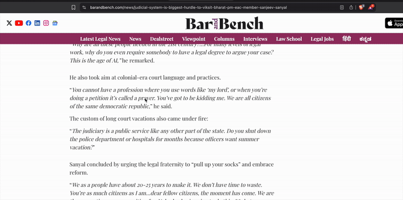
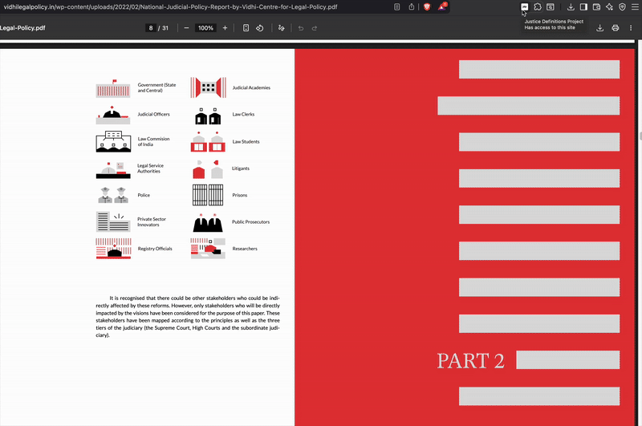

# Justice Definitions Project - Browser Extension

[](https://opensource.org/licenses/MIT)
[](https://github.com/ellerbrock/open-source-badges/)
[](http://makeapullrequest.com)

An open-source browser extension that makes legal language accessible by connecting webpage text selections to the Justice Definitions Project. This extension allows users to quickly look up legal definitions and contribute new terms for definition.

## Features

- **Quick Definition Lookup**: Select any legal term on any webpage and get instant definitions
- **Side Panel Interface**: Clean, non-intrusive side panel for seamless browsing experience
- **Request New Definitions**: Submit terms that need definitions to help expand the database
- **Geographic Logging**: Optional IP-based geographic tracking for analytics
- **Rate Limiting**: Built-in protection against abuse
- **Self-Hosted**: Complete control over your data and infrastructure
- **Customizable**: Easily modify to work with your own definition database

## Quick Start

### Prerequisites

- Google account (for Google Apps Script and Google Sheets)
- Modern browser (Chrome, Firefox, Edge, Safari)
- Basic knowledge of browser extension development (optional)

### How It Works

The extension provides two main ways to access legal definitions:

1. **Right-Click Lookup**: Select any legal term and right-click for instant definitions
2. **Side Panel Search**: Click the extension icon to open a dedicated search interface

Both methods allow you to request new definitions if they're not found in the database.

## Demo

### Right-Click Definition Lookup

*Select any legal term on any webpage and right-click for instant definition previews in a floating popup.*

### Side Panel Search Interface

*Click the extension icon to open the sliding overlay panel with built-in search and request functionality.*

### 1. Set Up Google Apps Script Backend

1. **Create a new Google Apps Script project**:
   - Go to [script.google.com](https://script.google.com)
   - Click "New Project"
   - Replace the default code with the contents of `google-apps-script/Code.gs`

2. **Configure the script**:
   - Replace all placeholder values in the `CONFIG` object:
     ```javascript
     const CONFIG = {
       SHEET_ID: 'YOUR_GOOGLE_SHEET_ID_HERE', // Your Google Sheet ID
       SECURITY: {
         ACCESS_KEY: 'your_secure_access_key_here', // Your secret key
         ENABLE_ACCESS_KEY_VALIDATION: true
       },
       // ... other configurations
     };
     ```

3. **Create a Google Sheet**:
   - Create a new Google Sheet
   - Copy the Sheet ID from the URL (the long string between `/d/` and `/edit`)
   - Update the `SHEET_ID` in your Apps Script

4. **Deploy the script**:
   - Click "Deploy" → "New deployment"
   - Choose "Web app" as the type
   - Set "Execute as" to "Me"
   - Set "Who has access" to "Anyone"
   - Copy the deployment URL

### 2. Configure the Browser Extension

1. **Update configuration files**:
   - Open `extension/config.js`
   - Replace `YOUR_GOOGLE_APPS_SCRIPT_DEPLOYMENT_ID_HERE` with your deployment ID
   - Open `extension/background.js`
   - Replace the webhook endpoint and access key with your values

2. **Load the extension**:
   - Open Chrome/Edge: Go to `chrome://extensions/`
   - Enable "Developer mode"
   - Click "Load unpacked" and select the `extension` folder
   - Pin the extension to your toolbar

## Project Structure

```
├── extension/                      # Browser extension files
│   ├── manifest.json              # Extension manifest
│   ├── background.js              # Background script
│   ├── content.js                 # Content script
│   ├── config.js                  # Configuration file
│   ├── popup/                     # Extension popup
│   ├── sidepanel/                 # Side panel interface
│   ├── options/                   # Extension options page
│   └── assets/                    # Icons and images
├── google-apps-script/            # Backend server code
│   └── Code.gs                    # Google Apps Script code
├── docs/                          # Documentation
│   ├── SETUP_GUIDE.md            # Setup instructions
│   ├── SECURITY.md               # Security guidelines
│   └── PRIVACY_POLICY.md         # Privacy policy
├── LICENSE                        # MIT License
├── CONTRIBUTING.md               # Contribution guidelines
└── README.md                     # This file
```

## Configuration Options

### Security Settings

```javascript
SECURITY: {
  ENABLE_ACCESS_KEY_VALIDATION: true,  // Require access key for requests
  ACCESS_KEY: 'your_secure_key',       // Secret key for authentication
  LOG_REQUESTS: true,                  // Log all requests
  LOG_IP_ADDRESSES: true,              // Log IP addresses
  LOG_GEOGRAPHY: true                  // Log geographic data
}
```

### Rate Limiting

```javascript
RATE_LIMIT_ENABLED: true,
MAX_REQUESTS_PER_HOUR: 1000,      // Maximum requests per hour per user
MAX_REQUESTS_PER_MINUTE: 30       // Maximum requests per minute per user
```

### Geographic Logging

```javascript
GEOGRAPHIC_LOGGING: {
  ENABLED: true,                   // Enable geographic tracking
  LOG_NON_INDIA_REQUESTS: true,    // Log requests from outside India
  LOG_ALL_REQUESTS: false          // Log all requests regardless of location
}
```

## Customization

### Adding Your Own Definition API

To connect to your own definition database instead of the Justice Definitions Project:

1. **Update the API endpoint** in `extension/config.js`:
   ```javascript
   const DEFAULT_CONFIG = {
     API_URL: "https://your-api-endpoint.com/api",
     // ... other settings
   };
   ```

2. **Modify the search logic** in the content and side panel scripts to match your API's response format.

### Customizing the UI

- **Icons**: Replace files in `extension/assets/` with your own icons
- **Colors**: Modify CSS in `extension/sidepanel/sidepanel.css` and `extension/popup/style.css`
- **Text**: Update strings in the HTML and JavaScript files

### Adding New Features

The extension is built with a modular architecture:
- **Background Script** (`extension/background.js`): Handles extension lifecycle and webhook requests
- **Content Script** (`extension/content.js`): Manages text selection and side panel integration
- **Side Panel** (`extension/sidepanel/`): Contains the main user interface
- **Options Page** (`extension/options/`): Extension settings and configuration

## Security Considerations

### For Production Use

1. **Use HTTPS**: Always use HTTPS for your webhook endpoints
2. **Rotate Keys**: Regularly change your access keys
3. **Monitor Logs**: Review your Google Sheets logs regularly
4. **Rate Limiting**: Adjust rate limits based on your usage patterns
5. **IP Restrictions**: Consider adding IP allowlists if needed

### Data Privacy

- **IP Logging**: Can be disabled by setting `LOG_IP_ADDRESSES: false`
- **Geographic Data**: Can be disabled by setting `GEOGRAPHIC_LOGGING.ENABLED: false`
- **Request Logging**: Can be disabled by setting `LOG_REQUESTS: false`

## Troubleshooting

### Common Issues

1. **Extension not loading**:
   - Check that all files are in the `extension` folder
   - Verify `manifest.json` is valid JSON
   - Check browser console for errors

2. **Webhook requests failing**:
   - Verify your Google Apps Script deployment URL
   - Check that your access key matches in both files
   - Review Google Apps Script execution logs

3. **Definitions not loading**:
   - Check network requests in browser dev tools
   - Verify API endpoints are accessible
   - Check for CORS issues

### Debug Mode

Enable debug logging by adding this to your configuration:
```javascript
const DEBUG = true;
```

## Contributing

We welcome contributions! Here's how you can help:

1. **Fork the repository**
2. **Create a feature branch**: `git checkout -b feature/amazing-feature`
3. **Commit your changes**: `git commit -m 'Add amazing feature'`
4. **Push to the branch**: `git push origin feature/amazing-feature`
5. **Open a Pull Request**

### Development Setup

1. Clone the repository
2. Set up your own Google Apps Script backend
3. Configure the extension with your credentials
4. Load the extension in developer mode
5. Make your changes and test them

## License

This project is licensed under the MIT License - see the [LICENSE](LICENSE) file for details.

## Acknowledgments

- Justice Definitions Project for the original concept
- Google Apps Script for the backend infrastructure
- The open-source community for inspiration and tools

---

**Note**: This is an open-source version of the Justice Definitions Project browser extension. Replace all placeholder values with your own credentials before use. Never commit secrets to public repositories.
